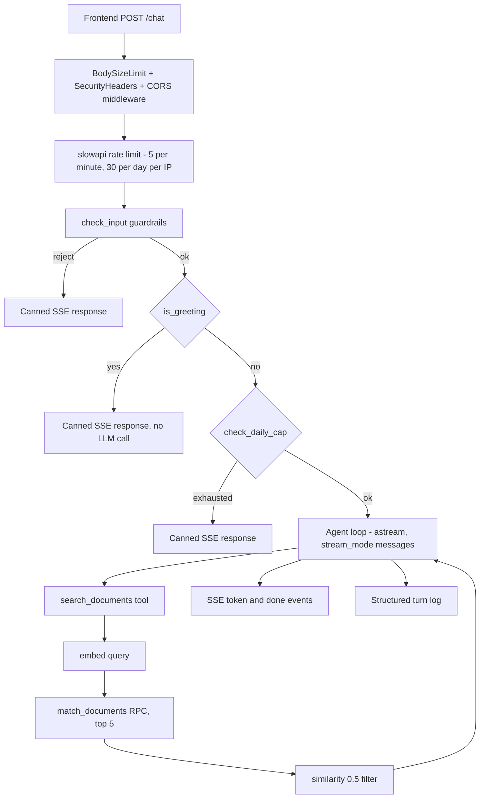
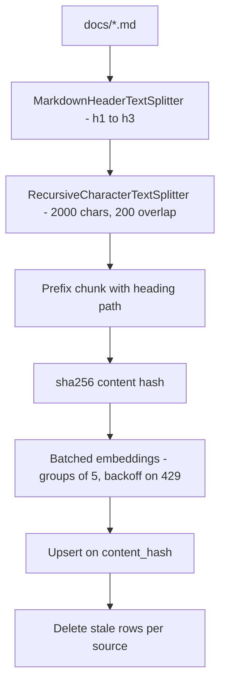

# Portfolio Chatbot Backend

Backend for a portfolio site's chat widget. It answers visitor questions about the site owner, grounded strictly in the owner's own documents (resume, project write-ups, about page). Retrieval is agentic: the model decides when and how many times to call a search tool via LangChain 1.x `create_agent`, rather than running a fixed embed-then-answer chain.

## Tech Stack

| Layer | Choice |
|---|---|
| API framework | FastAPI + uvicorn, SSE streaming responses |
| Validation | pydantic v2 |
| Agent runtime | LangChain 1.3 `create_agent` + middleware, running on the LangGraph runtime |
| Chat model | Gemini `gemini-2.5-flash` via `langchain-google-genai` |
| Embeddings | Gemini `models/gemini-embedding-001`, 768-dim, L2-normalized |
| Vector store | Supabase Postgres + pgvector, HNSW index, cosine distance, `match_documents` RPC |
| Tracing | LangSmith (optional) |
| Rate limiting | slowapi |
| Profanity filter | better-profanity |
| Tests | pytest |
| Runtime | Python 3.14 |
| Hosting | Render free tier + GitHub Actions keep-alive cron |

## Architecture

- `app/main.py` — FastAPI app; `POST /chat` (SSE) and `GET /health`; body-size, security-header, and CORS middleware.
- `app/agent.py` — builds the agent graph, defines the `search_documents` tool, and logs each turn.
- `app/retrieval.py` — embeds a query, calls the `match_documents` RPC, ranks/filters results.
- `app/llm.py` — the only module that touches `langchain_google_genai` (chat model + embedders).
- `app/prompts.py` — the system prompt.
- `app/guardrails.py` — input validation, greeting fast-path, daily cap, rate limiter.
- `app/supabase_client.py` — Supabase client construction.
- `ingest.py` — CLI that chunks, embeds, and upserts `docs/*.md` into Supabase.
- `supabase/schema.sql` — `documents` table, HNSW index, `match_documents` function.

`docs/` (the owner's personal source markdown) is gitignored; `docs_example/` holds seed copies for local setup.

## Query Pipeline



The agent loop is bounded by a tool-call budget of 4 (`ToolCallLimitMiddleware`) plus `ForceAnswerMiddleware`, which nudges the model to answer once the budget is spent, a `recursion_limit` of 30, and a 60-second `asyncio` timeout around the whole stream. Guardrail rejections, the greeting fast-path, and the daily-cap rejection all return a canned response through the same `_canned_stream` helper, so the client sees the identical `token` / `done` SSE event shape regardless of which path was taken. Every completed turn — including canned ones that never reach the agent — is summarized in one structured JSON log line.

## Ingestion Pipeline



Run with:

```
python ingest.py
```

Re-running is idempotent: unchanged chunks (same `content_hash`) are left alone, changed chunks upsert, and rows for a source that no longer produce a given hash are deleted.

## API

### `POST /chat`

Request:

```json
{
  "messages": [
    { "role": "user", "content": "What projects has the owner worked on?" }
  ]
}
```

The client holds conversation history and sends the full list each call; the server is stateless per request (no checkpointer).

Response: `Content-Type: text/event-stream`, one `data: <json>\n\n` line per event, each with `type` and `text`:

```
data: {"type": "token", "text": "The"}

data: {"type": "token", "text": " owner built a RAG-powered portfolio chatbot."}

data: {"type": "done", "text": ""}
```

An `error` event (generic, user-safe text) can appear instead of `done` as the final event, never both. See `plans/frontend-handoff.md` for the full contract.

### `GET /health`

Probes Supabase liveness (`SELECT id FROM documents LIMIT 1`). Returns `{"status": "ok"}` (200) or `{"status": "error"}` (503). Also the target hit by the keep-alive cron.

`/docs`, `/redoc`, and `/openapi.json` are disabled when `ENV=production`.

## Guardrails & Checks

**Input** (`app/guardrails.py:check_input`)
- Shape validation on every message.
- 2000-character cap per message.
- History truncated to the newest 10 messages.
- Control-character stripping.
- Rejects empty/blank newest user message.
- Profanity filter (`better-profanity`) on the newest user message only.

**Transport**
- 16KB `Content-Length` cap → 413; malformed `Content-Length` → 400 (`BodySizeLimitMiddleware`).
- Security headers: `X-Content-Type-Options: nosniff`, `X-Frame-Options: DENY`, `Referrer-Policy: no-referrer`.
- Strict CORS allowlist from `ALLOWED_ORIGINS`.

**Abuse / cost**
- Per-IP rate limits: 5/minute, 30/day (slowapi), keyed on the last `X-Forwarded-For` entry to avoid client-spoofed IPs.
- Global daily LLM cap (`GLOBAL_DAILY_CAP`, default 50), in-process counter reset on date change.
- Greeting fast-path returns a canned response with zero LLM calls.

**Agent bounds**
- `ToolCallLimitMiddleware(run_limit=4)` + `ForceAnswerMiddleware`.
- `ToolRetryMiddleware` / `ModelRetryMiddleware`, 1 retry each.
- `recursion_limit=30`, 60-second per-turn timeout.

**Prompt-injection posture**
- System prompt treats user text and retrieved search results as data, wrapped in `<search_results>` delimiters, never as instructions.
- Exactly one tool, read-only.
- Fixed refusal sentence when nothing relevant is found.
- Similarity floor of 0.5 on retrieved chunks.
- Client-facing errors are generic; stack traces are logged server-side only.

## Observability

LangSmith tracing activates automatically when `LANGSMITH_*` env vars are set — no code change required. Independently, one structured JSON log line is emitted per turn: `event: "turn"`, list of tool calls (query, chunk ids, scores), round count, and `outcome` (`answered` / `refused` / `budget_exhausted` / `error`).

## Testing

Six pytest suites:
- **Agent contract** — via an injected fake chat model, no real API calls.
- **Guardrails**
- **Ingest**
- **API / SSE**
- **Retrieval** — integration-marked, skipped unless `SUPABASE_URL` is set.
- **Security** — body-size cap, malformed headers, CORS, docs disabled in production.

```
pytest
```

## Deployment

`render.yaml` defines a free-tier Render web service: `pip install -r requirements.txt`, start command `uvicorn app.main:app --host 0.0.0.0 --port $PORT`, health check path `/health`. Secrets (`GOOGLE_API_KEY`, `SUPABASE_URL`, `SUPABASE_SERVICE_KEY`, `LANGSMITH_API_KEY`, `ALLOWED_ORIGINS`) are set in the Render dashboard, not the blueprint. `.github/workflows/keep-alive.yml` curls `/health` on a Monday/Thursday cron to counter Render's free-tier idle spin-down.

Env vars (`.env.example`):

| Variable | Purpose |
|---|---|
| `GOOGLE_API_KEY` | Gemini API key |
| `SUPABASE_URL` | Supabase project URL |
| `SUPABASE_SERVICE_KEY` | Supabase service-role key |
| `ALLOWED_ORIGINS` | Comma-separated exact origins allowed by CORS |
| `ENV` | `development` or `production` |
| `GLOBAL_DAILY_CAP` | Max LLM-touching turns per day (default 50) |
| `LANGSMITH_TRACING`, `LANGSMITH_API_KEY`, `LANGSMITH_PROJECT` | Optional tracing |

## Local Setup

```
pip install -r requirements.txt
cp .env.example .env        # fill in the values
```

Apply `supabase/schema.sql` in the Supabase SQL editor. Put markdown files in `docs/` (or copy from `docs_example/`), then:

```
python ingest.py
uvicorn app.main:app --reload
pytest
```
